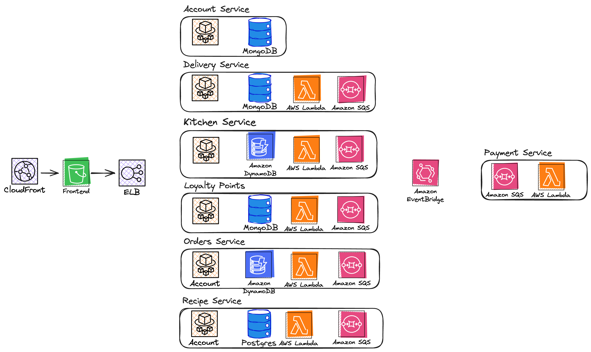
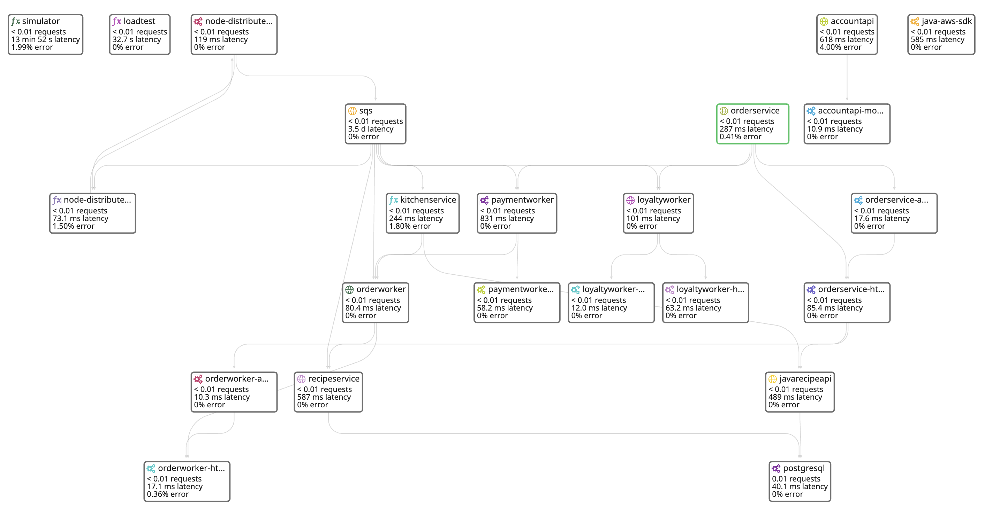

# Plant Based Pizza

> **IMPORTANT! Deploying resources in this repo may incur costs in your own AWS accounts.**

A reference serverless application implementing an online pizza restaurant using an event-driven architecture. If you want to build along with me, I'll be live streaming weekly on [Twitch](https://www.twitch.tv/plant_powered_james) and [YouTube](https://youtube.com/@serverlessjames) as I add more functionality to the application. Links to all live stream recordings and schedule can be found [here](./docs/livestream-recordings.md).

The application demonstrates various best practices and ways of building serverless applications across a range of different runtimes. The backend is made up of 7 seperate services:

- Orders (.NET) 
- [Kitchen (NodeJS)](./src/PlantBasedPizza.Kitchen.Node/README.md)
- Recipes (Java)
- Delivery (.NET)
- Payment (.NET) 
- Loyalty Points (.NET)
- Account (.NET)

Overtime, each service will run using a different runtime. Architecturally, most of the services follow a similar pattern of running a web workload on ECS Fargate to handle traffic from the UI. The majority of the processing runs asynchronous on AWS Lambda.

> **It is not recommended to purposefully build an application using every possible runtime, this is for example purposes only**

## Deploy

All deployments run through automated CICD pipelines, with integration tests in some of the services. Unit & integration testing, as well as CICD best practices for serverless applications will be added in upcoming streams.

Deployment instructions into your own account to follow

## Understand

The application is fully instrumented using Datadog native observability tooling.

*IMPORTANT: A fully OpenTelemetry enabled implementation is in the works*