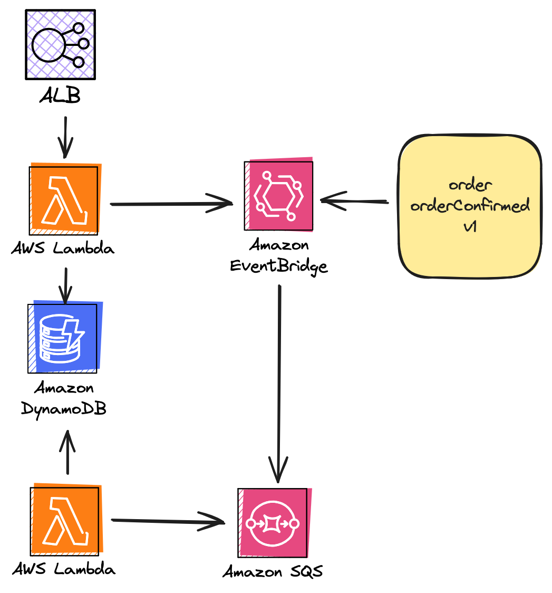

# Plant Based Pizza Kitchen Service



## Development

The CDK code used to deploy the main application, is split down into two custom L3 constructs. [`Api`](./lib/api.ts) and [`BackgroundWorker`](./lib/backgroundWorkers.ts). These constructs are used in the main CDK stack, [`KitchenStack`](./lib/kitchen-stack.ts). This is used to deploy the application to actual environments, for example `dev` and `prod`.

The CDK constructs are also used in the [`IntegrationStack`](./lib/integration-stack.ts). This stack is used for running integration tests, and can be used as part of your development workflow.

To deploy the kitchen services into your account, run the below commands:

```sh
export VERSION="je"
export ENV="je"
export INTEGRATION_TEST="true"
# If you want to use Datadog, store your API key in AWS Secrets Manager and set this secret name variable
export DD_API_KEY_SECRET_NAME=""
cdk deploy KitchenTestStack-${ENV}
```

Once deployed, you can run integration tests against the deployed resources:

```sh
npm run test integration-test
```